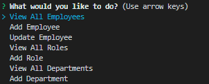

# Employee Tracker


## Description

The objective of this activity was to create an employee database that allows you to add employees, roles and departments. To run the application first install the applications (npm i). Then run the application using node index and it begins. When prompted the user will be asked a series of questions pretaining to what the user is trying to do. Below are some screenshots of what I am talking about.

Initial Prompt:

Adding Employee:

Viewing Table:

## Table of Contents 

* [Installation](#installation)

* [Usage](#usage)

* [License](#license)

* [Contributing](#contributing)

* [Tests](#tests)

* [Questions](#questions)

## Installation

To install necessary dependencies, run the following command:

```
npm i
```

## Usage

It is meant as template to further develop into a complete employee tracking database.

## License

This project is licensed under the MIT license.
    
## Contributing

Please feel to contribute to anything you find will be efficient to this application.

## Tests

To run tests, run the following command:

```
npm test
```

## Questions

If you have any questions about the repo, open an issue or contact me directly at jdefranco449@gmail.com. You can find more of my work at [jdefranco24](https://github.com/jdefranco24/).

